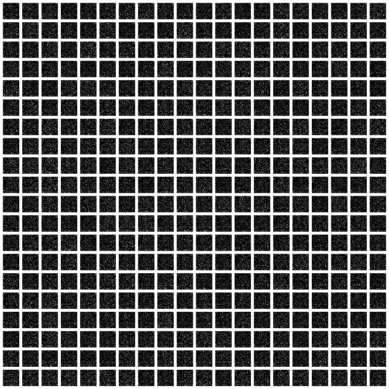
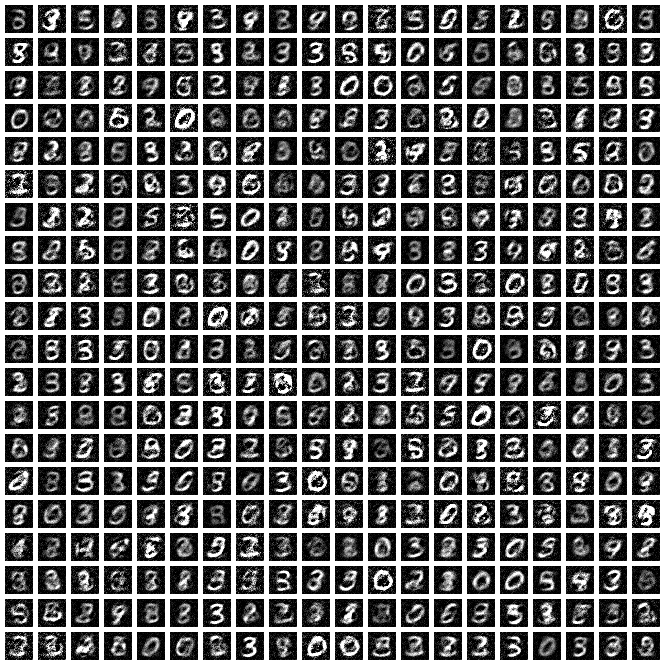
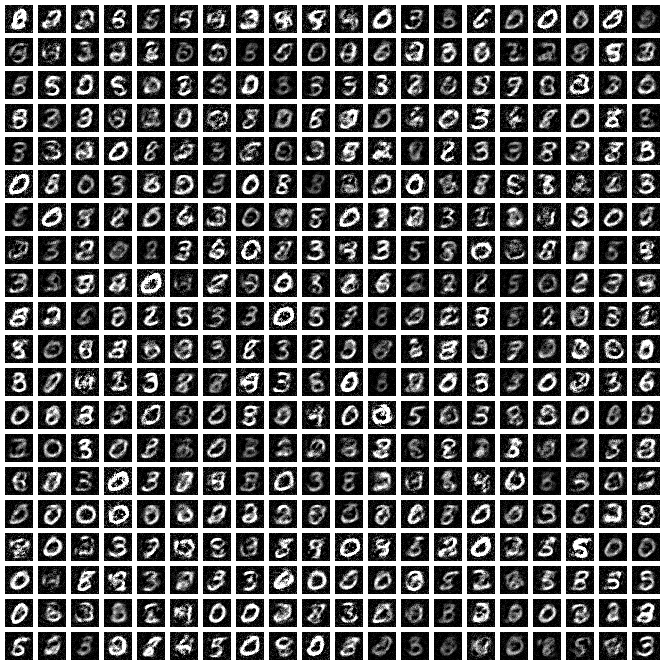
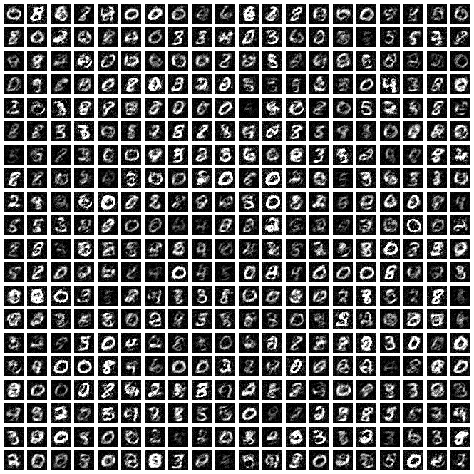
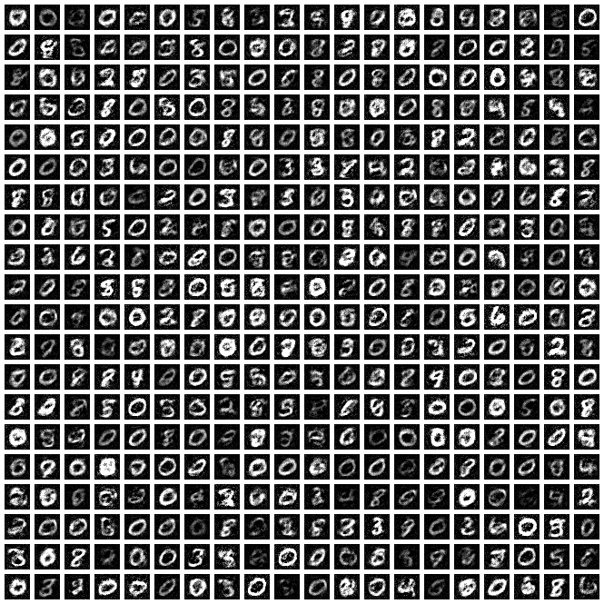
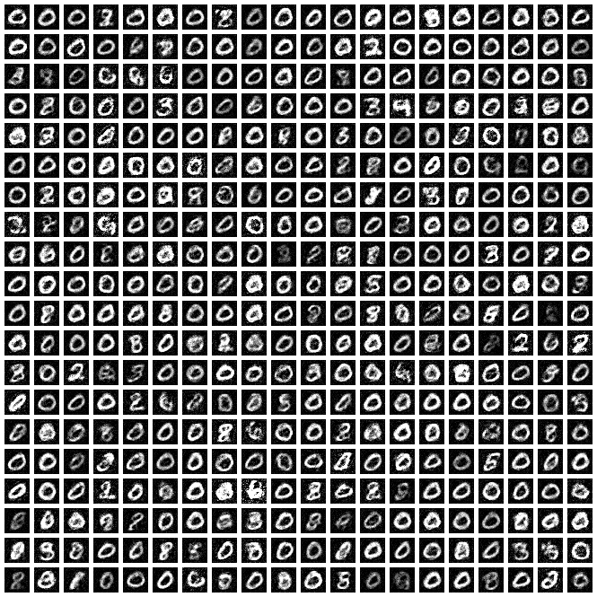
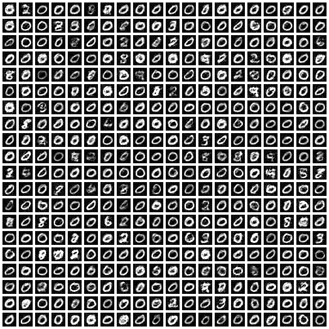

# Generative Adversarial Networks

A vanilla GAN. 

The versions I am using:

- Python 3.5.3
- TensorFlow 1.3.0

## Vanilla MNIST, Fully Connected Networks

This is the first attempt I did. The results look promising, but the GAN suffers from severe mode collapse once we're at 30k iterations. Darn.

00000 Iterations  |  05000 Iterations
:-------------------------:|:-------------------------:
  |  

10000 Iterations  |  15000 Iterations
:-------------------------:|:-------------------------:
  |  

20000 Iterations  |  25000 Iterations
:-------------------------:|:-------------------------:
  |  

30000 Iterations  |  35000 Iterations
:-------------------------:|:-------------------------:
  |  

Argh, it was looking so promising. I noticed that the Discriminator consistently got high classification accuracy (at least 60+) so this indicates that the Generator was not good enough.

Stats:

- Random seed: 0
- Discriminator: FC, 784 - 500 - 500 - 1, ReLUs only
- Generator: FC, 100 - 500 - 500 - 784, ReLUs only.
- Both used Adam with LR 0.001.
- Batch size of 32 real, 32 fake samples.

This was a very basic trial without tricks such as one-sided label smoothing, etc.
