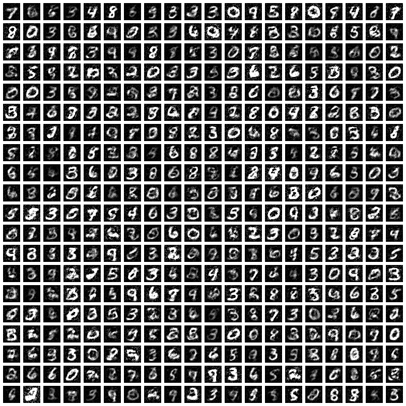

# Generative Adversarial Networks

A vanilla GAN, with the only "trick" being one-sided label smoothing.

- Python 3.5.3
- TensorFlow 1.3.0

# Vanilla MNIST, Fully Connected Networks

## Second Attempt

Now the results look a little better. What I did:

- Used `test_hyperparams_mnist.sh` to look for reasonable settings, then used
  `test_setting_mnist.sh` to test the best one after visual inspection (yeah
  yeah I know).
- One-sided label smoothing of 0.9.
- Discriminator: FC, 784 - 1024 - 512 - 1, ReLUs only
- Generator: FC, 100 - 256 - 512 - 784, ReLUs only.
- Both used Adam, LR 0.001.
- Gaussian noise, prior dimension 100.

I've noticed that:

- Gaussian noise seems slightly more reliable than uniform noise.
- Don't use more than two hidden layers, and if the networks are too large the
  results are bad.
- Most "bad" results are when there's mode collapse, e.g., everything turning
  into a bunch of 0s or something else. Though 0s were the most common
  single-digit mode collapse, I think.

- Three main problems. 
    
  1. Mode collapse to a single digit
  2. Blurry images
  3. Images that might be sharp and/or bright, but have lots of static

  I suspect that DCGANs will help fix these.

The following visuals images are from seed 3.

00000 Iterations  |  05000 Iterations
:-------------------------:|:-------------------------:
  |  

10000 Iterations  |  15000 Iterations
:-------------------------:|:-------------------------:
  |  

20000 Iterations  |  25000 Iterations
:-------------------------:|:-------------------------:
  |  

30000 Iterations  |  35000 Iterations
:-------------------------:|:-------------------------:
  |  

Here is a plot containing the results from all five seeds.  

I don't know why the Discriminator continues to classify things correctly. At
least the average real score has lower absolute value than the average fake
score's absolute value (because the one-sided label smoothing should decrease
the Discriminator's confidence on the real samples). But they really need to
both go to zero.

Note that the y-axis ranges are set to be equal for certain groups of plots.

## First Attempt

This is the first attempt I did. The results look promising, but the GAN suffers
from severe mode collapse once we're at 30k iterations. Darn.

00000 Iterations  |  05000 Iterations
:-------------------------:|:-------------------------:
  |  

10000 Iterations  |  15000 Iterations
:-------------------------:|:-------------------------:
  |  

20000 Iterations  |  25000 Iterations
:-------------------------:|:-------------------------:
  |  

30000 Iterations  |  35000 Iterations
:-------------------------:|:-------------------------:
  |  

Argh, it was looking so promising. I noticed that the Discriminator consistently
got high classification accuracy (at least 60+) so this indicates that the
Generator was not good enough.

Stats:

- Random seed: 0
- Discriminator: FC, 784 - 500 - 500 - 1, ReLUs only
- Generator: FC, 100 - 500 - 500 - 784, ReLUs only.
- Both used Adam with LR 0.001.
- Batch size of 32 real, 32 fake samples.
- Gaussian noise, dimension 100

This was a very basic trial without "tricks."
