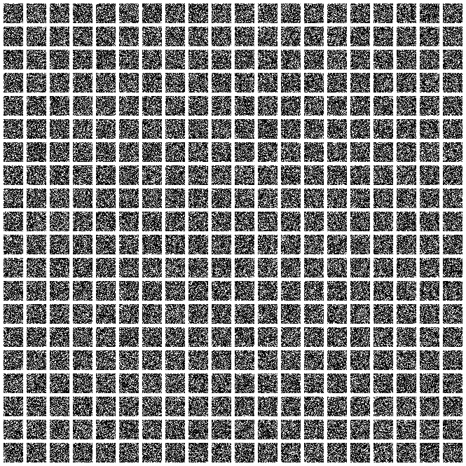
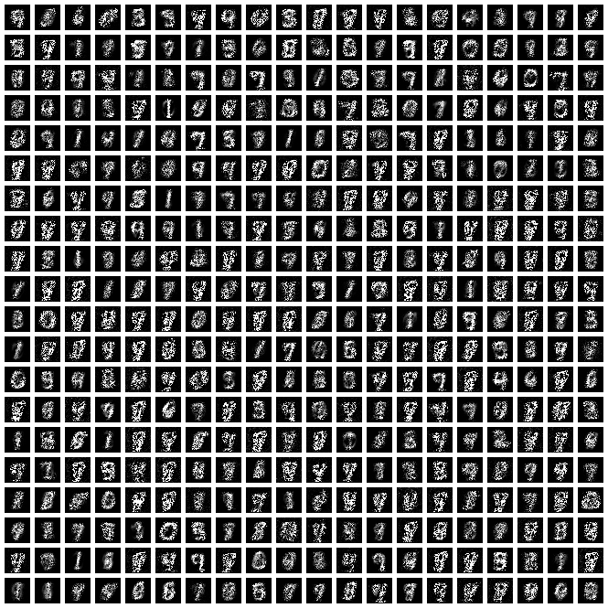
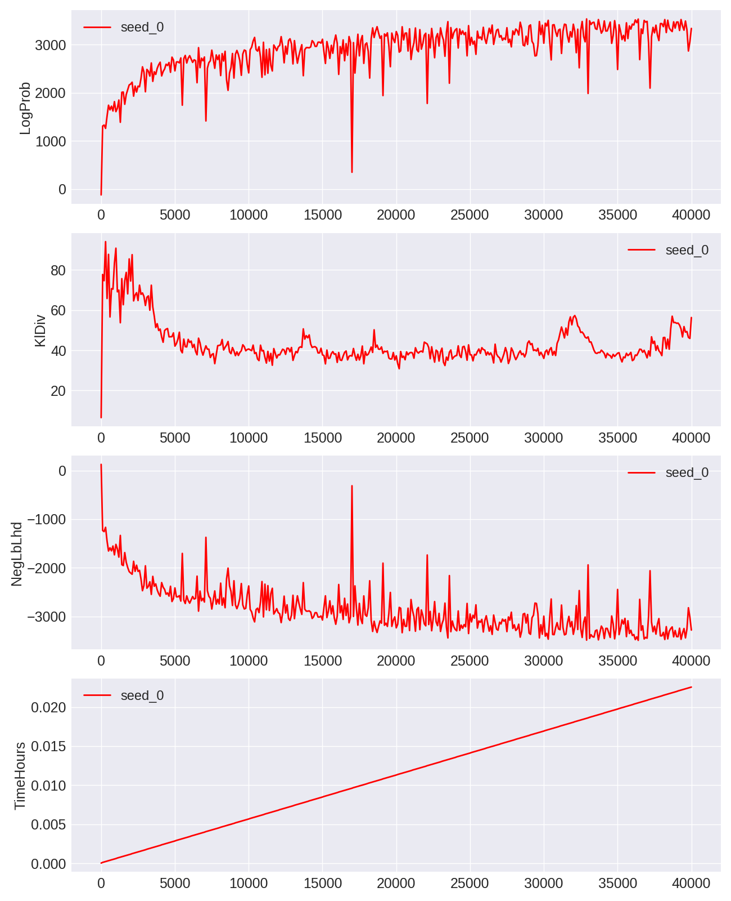

# Variational Autoencoder

A vanilla VAE.

- Python 3.5
- TensorFlow 1.2

Status: I *think* it's essentially complete but I will need to double check
everything.

There's something odd with the log probabilities, which are ... positive. But
this is because my decoder and encoder are predicting log standard deviation
vectors, and these are tending to negative values, so taking an exponential
means standard deviations are essentially zero, and thus the determinants are
essentially zero.

At least the VAE is able to produce stuff that looks reasonable. I will need to
tune this further.

00000 Iterations  |  05000 Iterations
:-------------------------:|:-------------------------:
  |  

10000 Iterations  |  15000 Iterations
:-------------------------:|:-------------------------:
  |  

20000 Iterations  |  25000 Iterations
:-------------------------:|:-------------------------:
  |  

30000 Iterations  |  35000 Iterations
:-------------------------:|:-------------------------:
  |  

Yeah, the log probabilities are ... not really log probabilities.

